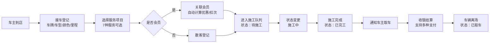

## 1. 产品概述

洗车行与汽车美容店管理系统，面向洗车门店经营者和前台接待人员，提供从车辆入场到收银离场的全流程数字化管理。

- 解决门店纸质登记繁琐、服务进度不透明、会员管理混乱等痛点
- 目标市场：中小型洗车行、汽车美容连锁店

## 2. 核心功能

### 2.1 用户角色

| 角色 | 登录方式 | 核心权限 |
|------|----------|----------|
| 管理员/前台 | 系统内置（演示模式免登录） | 接车登记、服务管理、状态跟踪、收银结算、会员管理 |

### 2.2 功能模块

1. **工作台仪表盘**：今日业绩概览、待施工/施工中/待取车数量统计、快捷操作入口
2. **接车登记**：录入车牌、车型、颜色、里程，选择服务项目
3. **服务项目管理**：普洗、精洗、打蜡、镀晶、内饰清洗、发动机舱清洗、贴膜共7种服务
4. **施工状态跟踪**：待施工 → 施工中 → 已完工 → 已取车，四状态流转
5. **会员管理**：次卡、月卡、年卡三种模式，次卡自动扣减并显示剩余次数
6. **收银结算**：支持现金/微信/支付宝/会员卡支付，自动计算优惠
7. **完工通知**：车辆完工后高亮提醒，可标记通知车主取车

### 2.3 页面详情

| 页面名称 | 模块名称 | 功能描述 |
|-----------|-------------|---------------------|
| 工作台 | 数据概览卡片 | 今日营收、在洗车辆、待取车辆、会员总数 |
| 工作台 | 快捷操作 | 快速接车、会员开卡、查看施工队列 |
| 工作台 | 最近订单列表 | 显示最近5条订单状态 |
| 接车登记 | 车辆信息表单 | 车牌号输入、车型选择、颜色选择、里程数输入 |
| 接车登记 | 服务项目选择 | 7种服务卡片多选，显示单价和时长 |
| 接车登记 | 会员信息关联 | 输入手机号查询会员，自动识别会员卡类型和剩余次数 |
| 施工管理 | 状态看板 | 按状态分列展示所有车辆订单（看板视图） |
| 施工管理 | 状态流转 | 点击按钮变更施工状态（待施工→施工中→已完工→已取车） |
| 会员管理 | 会员列表 | 显示所有会员信息、卡类型、剩余次数/有效期 |
| 会员管理 | 开卡/充值 | 新开次卡/月卡/年卡，次卡充值次数 |
| 收银结算 | 订单详情 | 显示服务明细、原价、会员折扣、应付金额 |
| 收银结算 | 支付方式 | 现金、微信、支付宝、会员卡余额/次数 |

## 3. 核心流程

**主业务流程**：车主到店 → 前台接车登记车辆信息 → 选择服务项目 → 关联会员（可选）→ 进入施工队列 → 状态流转（待施工→施工中→已完工）→ 完工通知取车 → 收银结算 → 车辆离场。

## 4. 用户界面设计

### 4.1 设计风格

- **主色调**：深邃藏蓝 `#0F2C59`（专业、可信）+ 金属钛银 `#C9A962`（高端、品质感）
- **辅助色**：状态绿 `#10B981`（已完工）、警示橙 `#F59E0B`（施工中）、通知红 `#EF4444`（待取车）
- **按钮风格**：圆角 8px，主按钮渐变填充，辅助按钮描边风格，带悬停上浮效果
- **字体**：标题使用「思源黑体 Bold」，正文使用「思源黑体 Regular」，数字使用等宽字体增强可读性
- **布局风格**：左侧导航栏 + 顶部标题栏 + 右侧主内容区，卡片式信息组织，带微妙阴影和圆角
- **图标风格**：Lucide 线性图标，统一 18px 尺寸，与文字基线对齐

### 4.2 页面设计概述

| 页面名称 | 模块名称 | UI 元素 |
|-----------|-------------|-------------|
| 工作台 | 数据概览 | 4 张渐变卡片，带图标和数据，hover 微动效 |
| 接车登记 | 表单区 | 左侧表单（分栏布局），右侧服务项目卡片网格 |
| 施工管理 | 看板 | 4 列状态看板（待施工/施工中/已完工/待取车），可拖拽卡片 |
| 会员管理 | 列表 | 表格 + 状态标签，次卡显示进度条样式的剩余次数 |
| 收银结算 | 结算单 | 类发票布局，项目明细 + 金额汇总 + 支付按钮组 |

### 4.3 响应式

- 桌面端优先设计（最小宽度 1280px）
- 平板端：侧栏折叠为图标模式，看板改为 2 列布局
- 移动端：底部 Tab 导航，看板改为单列纵向布局
