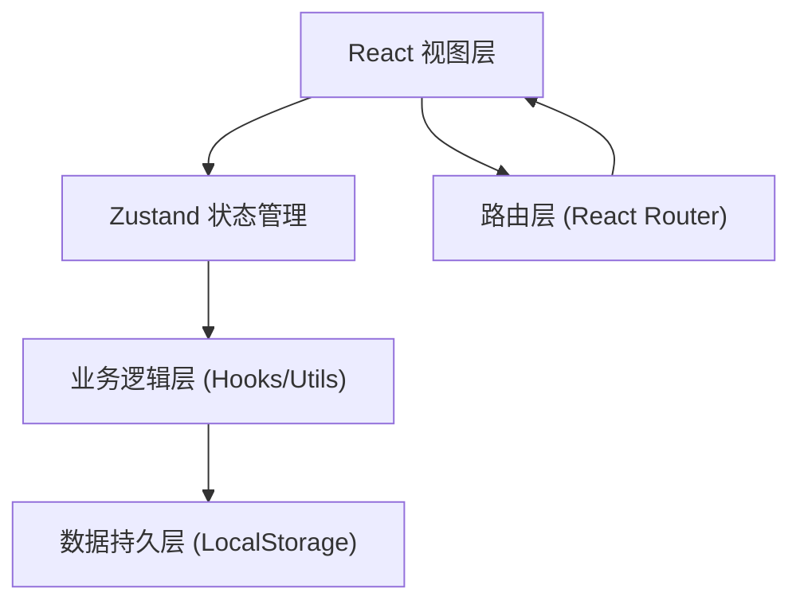
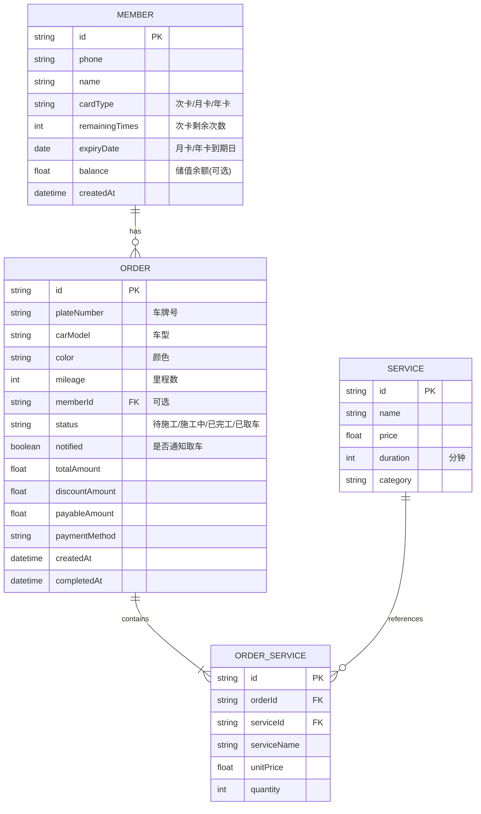

## 1. 架构设计

纯前端 SPA 应用，使用 LocalStorage 持久化存储模拟后端，Zustand 管理全局状态。

## 2. 技术选型说明

- **前端框架**：React@18 + TypeScript@5，组件化开发，类型安全
- **构建工具**：Vite@5，极速热更新，开发体验流畅
- **样式方案**：TailwindCSS@3，原子化 CSS + 自定义设计令牌
- **状态管理**：Zustand，轻量且 API 简洁，适合中小型应用
- **路由**：React Router DOM@6，声明式路由
- **图标**：Lucide React，统一风格的线性图标库
- **数据存储**：LocalStorage + JSON 序列化（演示模式，无需后端）

## 3. 路由定义

| 路由路径 | 页面名称 | 用途 |
|-----------|----------|------|
| `/` | 工作台 Dashboard | 数据概览 + 快捷操作 + 最近订单 |
| `/reception` | 接车登记 | 车辆信息录入 + 服务选择 + 会员关联 |
| `/construction` | 施工管理 | 状态看板 + 订单状态流转 |
| `/members` | 会员管理 | 会员列表 + 开卡充值 |
| `/checkout/:orderId` | 收银结算 | 订单详情 + 支付处理 |

## 4. 数据模型

### 4.1 数据模型定义 (ER 图)

### 4.2 初始数据 (Seed Data)

**服务项目（7种）**：

| ID | 名称 | 价格(元) | 时长(分钟) | 类别 |
|----|------|---------|-----------|------|
| S001 | 普洗 | 35 | 15 | 基础清洗 |
| S002 | 精洗 | 88 | 45 | 基础清洗 |
| S003 | 打蜡 | 168 | 60 | 美容养护 |
| S004 | 镀晶 | 1280 | 240 | 美容养护 |
| S005 | 内饰清洗 | 258 | 90 | 清洁养护 |
| S006 | 发动机舱清洗 | 128 | 30 | 清洁养护 |
| S007 | 贴膜（车窗） | 880 | 180 | 装饰服务 |

**会员卡类型定价**：

| 卡类型 | 价格(元) | 规则 |
|--------|---------|------|
| 次卡10次 | 300 | 仅限普洗，扣10次，有效期1年 |
| 月卡 | 199 | 30天内普洗不限次 |
| 年卡 | 1999 | 365天内普洗不限次，其他服务9折 |
